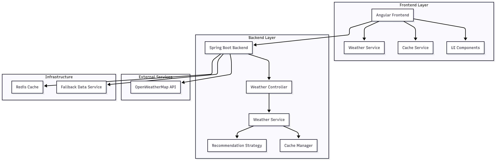
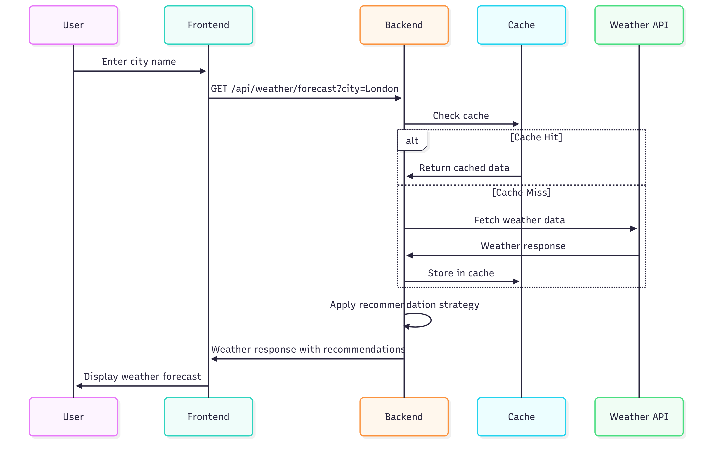

# Weather Forecast Microservice 🌤️

A comprehensive weather forecast microservice built with Angular frontend and Spring Boot backend that provides 3-day weather predictions with intelligent recommendations.

## 📋 Table of Contents

- [Features]
- [Architecture]
- [Design Patterns]
- [API Documentation]
- [Setup Instructions]
- [Testing]
- [Docker Deployment]
- [CI/CD Pipeline]
- [Security]
- [Performance]

## 🚀 Features

### Core Functionality
- **3-day weather forecast** for any city worldwide
- **Smart recommendations** based on weather conditions:
  - 🌡️ Temperature > 40°C: "Use sunscreen lotion"
  - ☂️ Rain predicted: "Carry umbrella"
  - 💨 Wind > 10mph: "It's too windy, watch out!"
  - ⛈️ Thunderstorm: "Don't step out! A Storm is brewing!"
- **Offline mode** with fallback data
- **Real-time caching** for improved performance
- **Responsive UI** with modern design

### Technical Features
- RESTful API with OpenAPI/Swagger documentation
- Comprehensive error handling and validation
- Unit and integration testing (TDD/BDD)
- Docker containerization
- CI/CD pipeline with Jenkins & GitHub Actions
- Security best practices implementation

## 🏗️ Architecture
For Diagrams please check the Architechture Diagram.png file in this directory


### System Flow Diagram
For Diagrams please check the System Flow Diagram.png file in this directory



## 🎯 Design Patterns

### Backend (Spring Boot)
1. **Strategy Pattern**: `WeatherRecommendationStrategy` - Encapsulates recommendation logic
2. **Factory Pattern**: `WeatherRecommendationFactory` - Creates recommendation messages
3. **Singleton Pattern**: Spring beans managed as singletons
4. **Template Method Pattern**: RestTemplate for HTTP operations
5. **Observer Pattern**: Spring Events for cache invalidation
6. **Builder Pattern**: DTOs with Lombok @Builder

### Frontend (Angular)
1. **Service Pattern**: `WeatherService` for API communication
2. **Observer Pattern**: RxJS Observables for async operations
3. **Dependency Injection**: Angular's DI container
4. **Component Pattern**: Modular UI components
5. **Facade Pattern**: Services as facades to backend APIs

## 📚 API Documentation

### Base URL
- Development: `http://localhost:8080/api`
- Swagger UI: `http://localhost:8080/swagger-ui/index.html`

### Endpoints

#### GET /weather/forecast
Get 3-day weather forecast for a city.

**Parameters:**
- `city` (required): City name
- `offline` (optional): Enable offline mode

**Response:**
JSON :-
{
  "city": "London",
  "forecasts": [
    {
      "date": "2024-01-15",
      "highTemp": 25.5,
      "lowTemp": 15.3,
      "windSpeed": 8.2,
      "hasRain": false,
      "hasThunderstorm": false,
      "recommendations": []
    }
  ],
  "timestamp": "2024-01-15T10:30:00Z",
  "offline": false
}

#### GET /weather/health
Health check endpoint.

**Response:** `Weather service is running!`

## 🛠️ Setup Instructions

### Prerequisites
- Java 17+
- Node.js 18+
- Maven 3.6+
- Docker & Docker Compose
- OpenWeatherMap API key

### Backend Setup

1. **Go to service Directory**
```bash
cd service
```

2. **Set environment variables**
```bash
export WEATHER_API_KEY=your_openweather_api_key
```

3. **Build and run**
```bash
./mvnw clean install
./mvnw spring-boot:run
```

### Frontend Setup

1. **Navigate to frontend directory**
```bash
cd ../WeatherApplication
```

2. **Install dependencies**
```bash
npm install
```

3. **Start development server**
```bash
ng serve
```

4. **Access application**
- Frontend: `http://localhost:4200`
- Backend API: `http://localhost:8080/api`
- Swagger UI: `http://localhost:8080/swagger-ui/index.html`

## 🧪 Testing

### Backend Testing
```bash
cd ../service
./mvnw test                    # Unit tests
./mvnw integration-test        # Integration tests
./mvnw jacoco:report          # Coverage report
```

### Frontend Testing
```bash
cd ../WeatherApplication
npm test                      # Unit tests
npm run test:ci              # CI mode tests
npm run e2e                  # E2E tests
```

### Test Coverage
- **Backend**: Target 80%+ line coverage
- **Frontend**: Target 75%+ line coverage
- Reports available in `target/site/jacoco` and `coverage/` directories

## 🐳 Docker Deployment

### Using Docker Compose
```bash
# Set environment variables
export WEATHER_API_KEY=your_api_key

# Start all services
docker-compose up -d

# View logs
docker-compose logs -f

# Stop services
docker-compose down
```

### Individual Services
```bash
# Backend
docker build -t weather-backend ./service
docker run -p 8080:8080 -e WEATHER_API_KEY=your_key weather-backend

# Frontend
docker build -t weather-frontend ./WeatherApplication
docker run -p 4200:80 weather-frontend
```

## 🚀 CI/CD Pipeline

### Jenkins Pipeline
The pipeline includes:
1. **Code Checkout** from Git
2. **Build & Test** both frontend and backend
3. **Security Scanning** with OWASP and npm audit
4. **Code Quality** analysis with SonarQube
5. **Docker Build** and push to registry
6. **Integration Testing** with test containers
7. **Deployment** to staging/production

### GitHub Actions
Automated workflows for:
- Pull request validation
- Security vulnerability scanning
- Docker image building
- Automated deployment

## 🔒 Security

### API Security
- **API Key Protection**: Encrypted and stored securely
- **CORS Configuration**: Restricted origins
- **Input Validation**: Comprehensive parameter validation
- **Rate Limiting**: Prevents API abuse
- **HTTPS Enforcement**: TLS encryption

### Container Security
- **Non-root user**: Containers run as non-root
- **Minimal base images**: Alpine Linux for smaller attack surface
- **Security scanning**: Trivy vulnerability scanning
- **Secrets management**: Environment variables for sensitive data

### Code Security
- **Dependency scanning**: Regular vulnerability checks
- **Static analysis**: SonarQube code quality gates
- **Security headers**: Proper HTTP security headers

## ⚡ Performance

### Backend Optimizations
- **Caching Strategy**: Redis for API response caching
- **Connection Pooling**: Optimized HTTP client configuration
- **JVM Tuning**: Container-aware JVM settings
- **Async Processing**: Non-blocking operations where possible

### Frontend Optimizations
- **Lazy Loading**: Route-based code splitting
- **HTTP Caching**: Proper cache headers utilization
- **Bundle Optimization**: Tree shaking and minification
- **Service Worker**: Offline caching capabilities

### Monitoring
- **Health Checks**: Comprehensive health endpoints
- **Metrics**: Actuator metrics for monitoring
- **Logging**: Structured logging with correlation IDs
- **APM Integration**: Ready for application performance monitoring

## 🔧 Configuration

### Environment Variables

#### Backend
```bash
WEATHER_API_KEY=your_openweather_api_key
SPRING_PROFILES_ACTIVE=production
REDIS_HOST=localhost
REDIS_PORT=6379
SERVER_PORT=8080
```

#### Frontend
```bash
API_BASE_URL=http://localhost:8080/api
ENABLE_OFFLINE_MODE=true
```

## 📊 SOLID Principles Implementation

1. **Single Responsibility**: Each class has one reason to change
2. **Open/Closed**: Strategy pattern allows extension without modification
3. **Liskov Substitution**: Proper inheritance hierarchies
4. **Interface Segregation**: Focused interfaces for specific concerns
5. **Dependency Inversion**: Dependency injection throughout

## 📈 12-Factor App Compliance

1. **Codebase**: Single codebase tracked in version control
2. **Dependencies**: Explicit dependency declaration
3. **Config**: Configuration stored in environment
4. **Backing Services**: External services as attached resources
5. **Build/Release/Run**: Strict separation of stages
6. **Processes**: Stateless processes
7. **Port Binding**: Self-contained services
8. **Concurrency**: Horizontal scaling support
9. **Disposability**: Fast startup and graceful shutdown
10. **Dev/Prod Parity**: Development/production environments similar
11. **Logs**: Treat logs as event streams
12. **Admin Processes**: Administrative tasks as one-off processes

## 🤝 Contributing

1. Fork the repository
2. Create a feature branch (`git checkout -b feature/amazing-feature`)
3. Commit your changes (`git commit -m 'Add amazing feature'`)
4. Push to the branch (`git push origin feature/amazing-feature`)
5. Open a Pull Request

## 📄 License

This project is licensed under the MIT License - see the [LICENSE](LICENSE) file for details.

## 📞 Support

- **Email**: weather-service@company.com
- **Documentation**: [API Docs](http://localhost:8080/swagger-ui/index.html)
- **Issues**: [GitHub Issues](https://github.com/your-repo/weather-service/issues)

---

Built with ❤️ using Angular, Spring Boot, and modern DevOps practices.